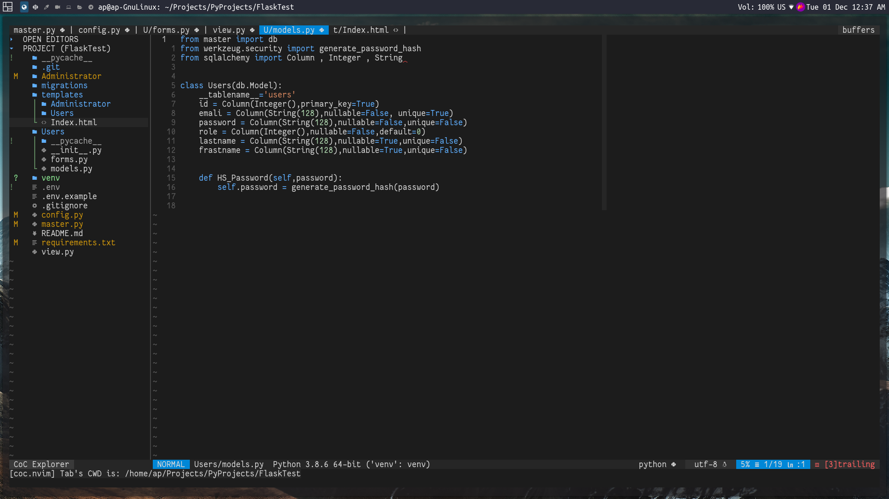
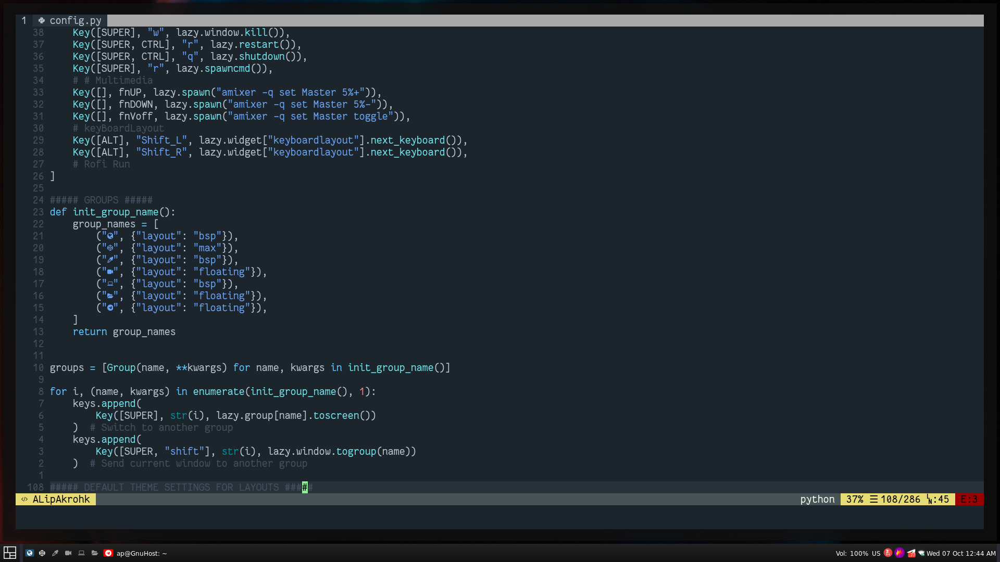

### NvPakrohk Screenshot





# NvPakrohk
This is a configuration for the **NeoVIM** editor, My goal in **sharing** and designing this config was to make the most convenient **NeoVim** config for **users**, Since this config is designed for easier use by **users**, People can also contribute to the development of that.

## Prerequisites

* **NVIM v0.4.4 or later**
* **NodeJS**
* **Vim-Plug**
* **OmniSharp-Roslyn**
* **last Mono Version**
* **PipPython 3.8 or later**
* **xsel**

## Installing

 Make sure your nvim folder is empty.

* Gnu/Linux and MacOs
```
git clone --depth 1 https://github.com/Pakrohk-DotFiles/NvPakrohk.git ~/.config/nvim
```

To install the applied plugins, enter the following command in the terminal.

```
nvim +PlugInstall
```

## Install python & node support

```
pip install pynvim
```

```
npm i -g neovim
```

## Description For Better Use of Config
After installing the prerequisites and replacing the config files, edit the `coc-settings.json` file and modify the specified paths.

The `basic.vim` file has default changes such as **vim color** and file format **settings**, the main **keys** are set in the `key.vim` file and **plugins** are introduced in the `plug.vim` file, the change is very easy for you. The **plugin settings** are in the `CfgPlug` folder (Try to choose file names as simple as possible, as it makes editing easier.) Finally, all the changes in the `init.vim` file are called and **introduced to NeoVim**.
